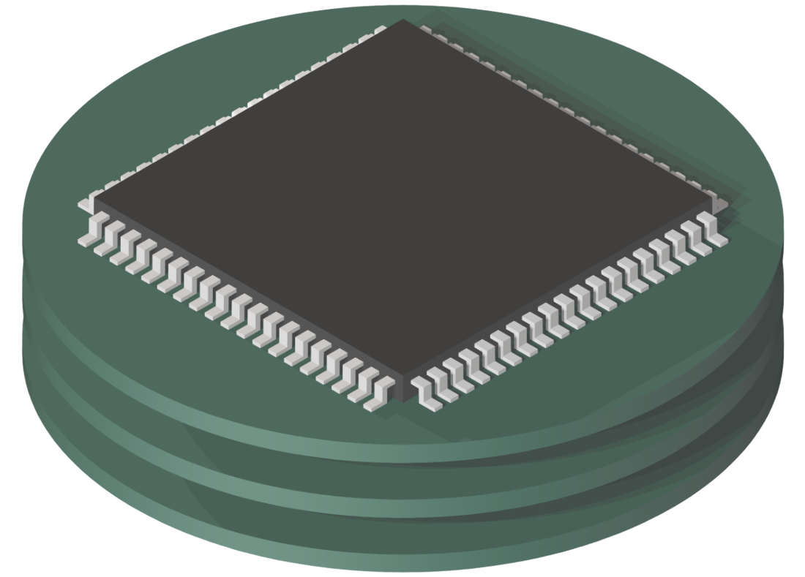

<p align="center">
  
</p>

# partman

Personal electronic part database manager

## About

Automatically organize, track, and inventory all your electronic components.

I like to build small circuits and development boards. This requires me to design and buy PCBs along with electronic components. The problems arises when the minimum order quantity is way more than you need, or when you don't end up building as many boards as you were expecting, leaving you with a bunch of teeny-tiny components that are often too unique to use anywhere else. The lead me to attempting to keep track of them so I can design future boards around the components I already have. I have tried different solutions but none of them gave me the simplicity I wanted. This is an attempt to create a solution to that problem.


## Installation

### Docker

_Coming soon_

### Manually Install on Linux

1. Download latest release of partman for your system

2. Initialize database

```
partman serve
```

Visit the link and follow the steps to create a new admin account.
Kill partman.

```
partman init
```

3. Start partman

```
partman serve --http="0.0.0.0:8090"
```

4. (optional) Create systemd service

```
sudo nano /lib/systemd/system/partman.service
```

```
[Unit]
Description = partman

[Service]
Type           = simple
User           = partman
Group          = partman
LimitNOFILE    = 4096
Restart        = always
RestartSec     = 5s
StandardOutput = append:/home/partman/errors.log
StandardError  = append:/home/partman/errors.log
WorkingDirectory=/home/partman/
ExecStart      = /home/partman/partman serve --http="0.0.0.0:8080"

[Install]
WantedBy = multi-user.target
```

```
sudo systemctl daemon-reload
sudo systemctl restart partman
sudo systemctl status partman
```

## Developing

🚀 Technologies used:

- Geeker Admin (from latest commit on 7/31/22)
- Vue 3.2
- Vite 2
- TypeScript
- Pinia
- Element-Plus
- PocketBase

### Dev Setup

Install prerequisites

```
go get github.com/pocketbase/pocketbase
npm i
```

Run server environment

```
npm run dev:server
```

Run client environment with HRM in another terminal

```
npm run dev:client
```

### Build

```
npm run release:build
```

### Config

- Database Admin: admin@mail.com : partmanpass
- Default User: partman : partman@mail.com : partmanpass
